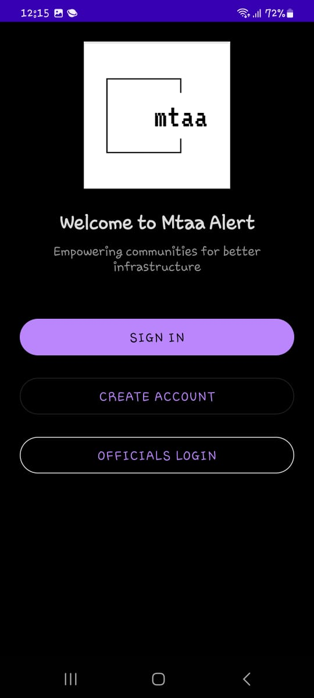

# MTAA - Mobile Civic Issue Reporter

## Project Overview
An Android application for reporting civic issues to authorities including road breakdowns, street light problems, and emergency situations. Features secure submission workflows, real-time status tracking, and integrated emergency services contact using Firebase services.

## Key Features
- Emergency reporting workflow with priority categorization
- GPS-integrated issue submission with photo evidence
- Real-time status updates via Firestore
- Municipal authority communication channels
- Offline-capable reporting system
- Emergency services quick contact integration

## Installation
1. Clone this repository
2. Open in Android Studio (Electric Eel or newer)
3. Add `google-services.json` to `app/` directory
4. Sync Gradle dependencies

## Firebase Configuration
- Enable Authentication, Firestore, and Storage in Firebase Console
- Configure Firestore persistence in `MtaaApplication.java`

## Use Cases
- Road hazards reporting with location tagging
- Street light outage notifications
- Emergency dispatch coordination
- Infrastructure damage documentation

## Tech Stack
- Android SDK 34
- Firebase (Auth, Firestore, Storage)
- Google Play Services (Maps, Location)
- Material Components 2.7.7
- Emergency Services API integration

## Contributing
1. Fork the repository
2. Create feature branches
3. Submit PRs with detailed descriptions
4. Follow civic service focused architecture patterns

## License
Apache License 2.0